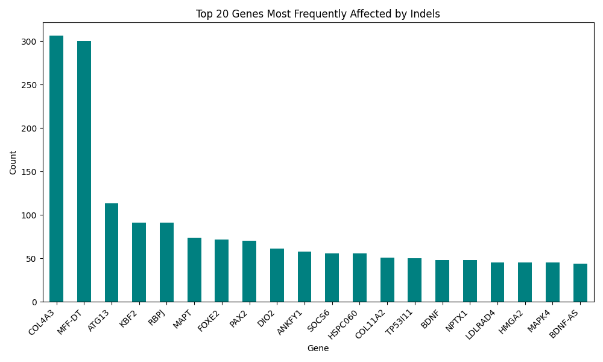

# Comprehensive Genomics Analysis Pipeline

## Overview

This project provides a suite of Python scripts for genomic data processing and analysis, focusing on short indels, variant annotation, and clinical relevance. It includes tools for reading and processing VCF files, querying clinical relevance databases, and annotating variants with additional genomic information.

## Features

1. **Short Indel Identification**: 
   - Processes SAM files to identify short indels.
   - Outputs results in VCF format, including detailed variant information.

2. **VCF Processing and Database Integration**: 
   - Reads VCF files and integrates variant data into a SQLite database.
   - Annotates variants with gene information and clinical relevance.

3. **Clinical Relevance Annotation**: 
   - Fetches clinical relevance data from external APIs.
   - Annotates genes with clinical labels ('Green', 'Amber', 'Red').

4. **Genomic Analysis and Visualization**: 
   - Analyzes and visualizes affected genes and variant distribution.
   - Provides population-specific variant frequencies.

## Requirements

- **Python 3.6 or higher**
- **Python Packages**:
  - requests
  - sqlite3
  - pandas
  - matplotlib
  - pytest (for testing)

Install the required packages using the following command:

```bash
bash requirements/requirements.sh
```

## Setup

1. **Download and Prepare Data**:
   - Ensure blastdb, GFF, and SAM files are ready.
   - Use provided scripts to download reference genome files if needed.
   
```bash
bash requirements/blast.sh

python requirements/download_SAM_fromS3.py

python requirements/download_gff.py
```  


## Usage

### 1. Short Indel Identification

Identify short indels in a SAM file and store in a VCF file (can produce pseudoVCFs if pseuso paramenter is set to True):

```bash
python main/sam_to_vcf  path/to/your/samfile.sam --Pseudo
```

### 2. VCF Processing and Database Integration

Process a VCF file and store results in a SQLite database:

```bash
python vcf_to_database.py --vcf path/to/your.vcf --assembly GRCh38
```

### 3. Clinical Relevance and affected Genes Annotation

Annotate variants in the database with clinical relevance data:

```bash
python main/adding_gene.py
python main/check_clinical_relevance.py path/to/database.db
```

### 4. Genomic Analysis

Run analysis scripts to generate gene frequency and population distribution data:

```bash
bash analysis/run_analysis.sh
```

### 5. VCF reader

Analyse a VCF files as input and it informs the user if a varaint call affect a trascript with gap along with its clinical relevance
```bash
python main/expected_variant_vcf_reader.py path/to/vcf_file_to_test
```

## Output

### VCF Files

Generated VCF files include identified indels and annotations:

```
#CHROM  POS     ID  REF ALT QUAL    FILTER  INFO
1       136889  .   NN  A   99      PASS    DP=100;LEN=1;TYPE=DEL;TRANSCRIPT=NR_039983.1;TRANSCRIPT_POS=45;CIGAR:3=1X11=1X2=1X16=1X9=1D6=3X9=1X2=1X2785=93N58=227N492=;GENOME_REF=NC_000001.11
```

### SQL database containing indels along with affected genes, allele frequencies from Gnomad, and clinical relevance of affected genes from PanelApp


### Analysis Results

Generated plots and tables include:
- Top genes affected by indels.
- Indel distribution across populations.



### VCf file reader
Output expected variants (indels in the reference transscript) present in the VCF file along with clinical relevance


For any issue or question feel free to contact me on david.mandia@yahoo.com  


